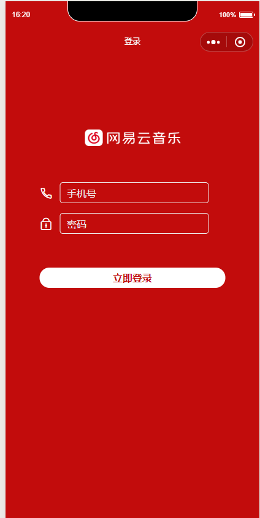
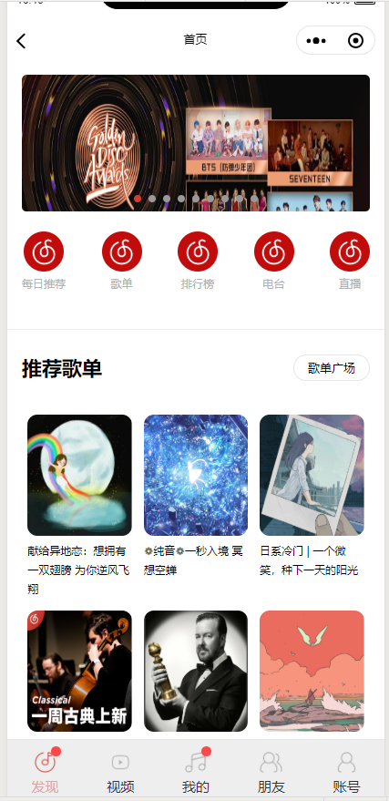

### taro 仿网易云音乐  
---
#### 接口数据来源  [NeteaseCloudMusicApi](https://github.com/Binaryify/NeteaseCloudMusicApi) (膜拜一波大佬)

##### 注意事项
确保你本地的taro-cli的版本和项目版本一致否则会运行失败，解决方案参考[官方文档](https://taro-docs.jd.com/taro/docs/GETTING-STARTED.html#%E7%8E%AF%E5%A2%83%E5%8F%8A%E4%BE%9D%E8%B5%96%E6%A3%80%E6%B5%8B)
#### 项目功能 （更新中...）
- [x] 登录
- [x] 首页
- [x] 视频页
- [x] 每日推荐
- [ ] 歌单
- [ ] 排行榜
- [ ] 电台
- [ ] 音乐播放

#### 项目部分截图

